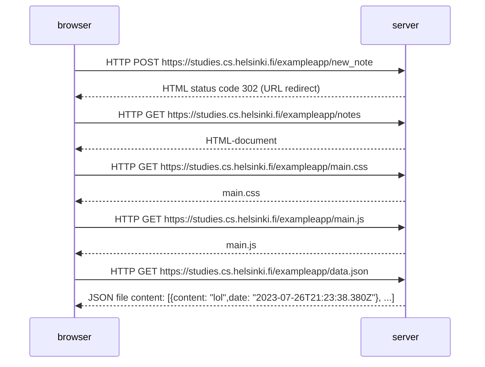

```mermaid
sequenceDiagram
    participant browser
    participant server
    browser->>server: HTTP POST https://studies.cs.helsinki.fi/exampleapp/new_note

    server-->>browser: HTML status code 302 (URL redirect)
    browser->>server: HTTP GET https://studies.cs.helsinki.fi/exampleapp/notes
    server-->>browser: HTML-document
    browser->>server: HTTP GET https://studies.cs.helsinki.fi/exampleapp/main.css
    server-->>browser: main.css
    browser->>server: HTTP GET https://studies.cs.helsinki.fi/exampleapp/main.js
    server-->>browser: main.js
    browser->>server: HTTP GET https://studies.cs.helsinki.fi/exampleapp/data.json
    server-->>browser: JSON file content: [{content: "lol",date: "2023-07-26T21:23:38.380Z"}, ...]
```
